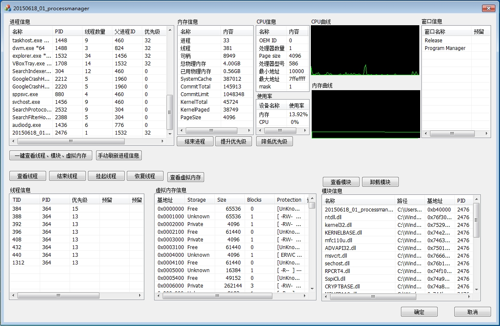

# simple-process-manager

A simple process manager for Windows:
- Process: terminate, increase/decrease priority
- Thread: terminate, suspend, resume
- Virtual memory: base address, size, access protection
- Modules: name, path, base address, unload
- CPU information and usage curve
- Physical memory information and usage curve
- Windows enumeration

Executable File Download: [Google Drive](https://drive.google.com/drive/folders/1tvMn8uuST9mfevXz1v972taTqs-nn36U?usp=sharing)